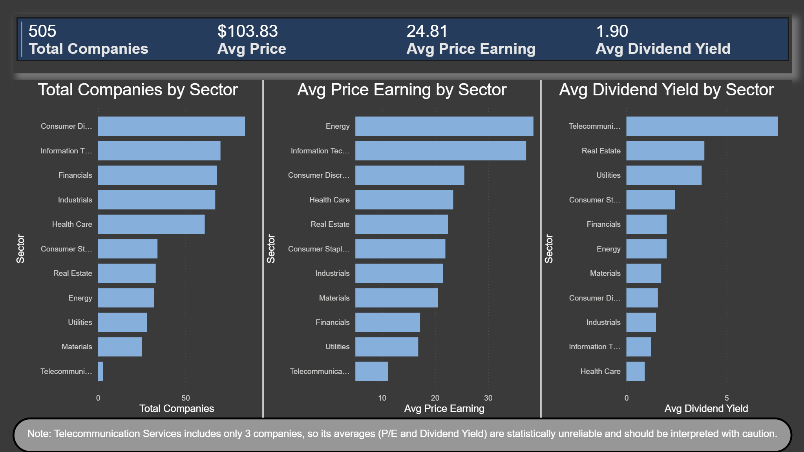

# 📈 S&P 500 Financial Analysis (FY2018) | Análisis Financiero del S&P 500

> Interactive Power BI dashboard analyzing 505 S&P 500 companies — comparing sectors by valuation and dividends, and mapping investment opportunities through a valuation-vs-yield scatter analysis.
> Dashboard interactivo en Power BI que analiza 505 empresas del S&P 500 — comparando sectores por valoración y dividendos, e identificando oportunidades de inversión mediante un análisis de valoración vs rendimiento.

---

## 🇬🇧 English

### 📋 Project overview

Interactive Power BI dashboard analyzing the **505 companies of the S&P 500 index** using fundamental financial data. The project applies the full analytics workflow — data validation, modeling, DAX measures, and visualization — to answer investment-oriented questions about sectors, valuation, and dividends.

### 🎯 Objectives

The dashboard covers three analytical angles:
- **Market overview** — how is the index composed across sectors?
- **Sector comparison** — which sectors are most expensive (P/E) and which pay the most dividends?
- **Investment opportunities** — where do value and growth companies sit on a valuation-vs-yield map?

### 📊 Dataset

- **Source:** S&P 500 Companies with Financial Information — Kaggle
- **Records:** 505 companies across 11 sectors
- **Period:** FY2018 (a snapshot of the market at that time)
- **Key columns:** Symbol, Name, Sector, Price, Price/Earnings, Dividend Yield, Earnings/Share, 52-Week Low/High, Market Cap, EBITDA, Price/Sales, Price/Book

### 🛠️ Tools & techniques

- **Power BI Desktop** — modeling and visualization
- **Power Query (M language)** — data cleaning and validation
- **DAX** — calculated measures
- **Data visualization** — dark-themed two-page report with reference-line scatter analysis

### ⚙️ Data preparation & validation

- Removed non-analytical column (SEC Filings URL)
- Kept genuine nulls in P/E and Price/Book (10 companies) rather than fabricating values — these represent cases where the ratio doesn't apply (e.g. companies with losses)
- **Validated uniqueness:** confirmed no duplicate companies using Power Query's column profiling (Symbol showed 505 distinct / 505 unique values, matching the total row count)

### 🧮 Key DAX measures

| Measure | Purpose |
|---------|---------|
| `Total Companies` | Company count using `COUNTROWS` (each row is a unique company) |
| `Avg Price` | Average share price |
| `Avg Price Earning` | Average P/E ratio (valuation) |
| `Avg Dividend Yield` | Average dividend yield |

### 🔍 Key findings

**1. The market looked relatively expensive in 2018.** The average P/E of 24.81 sits well above the S&P 500's long-term historical average (~15–16), suggesting investors were paying a premium, likely pricing in growth expectations.

**2. Energy's high P/E was a warning sign, not strength.** Energy showed the highest average P/E (38.56). Counterintuitively for a non-growth sector, this reflects *depressed earnings* after years of low oil prices — when earnings shrink, P/E inflates even without a price increase. A high P/E doesn't always mean confidence; sometimes it means collapsed earnings.

**3. Real Estate is the reliable dividend play.** Excluding the small-sample Telecom sector, Real Estate led dividends (~3.89%), consistent with REITs' legal obligation to distribute most earnings. Health Care paid the least (~0.92%), reinvesting in R&D instead.

**4. A clear value-vs-growth pattern.** The scatter of P/E vs Dividend Yield reveals an inverse relationship: low-P/E companies tend to pay higher dividends (mature "value" firms), while high-P/E companies pay little (reinvesting "growth" firms). The upper-left quadrant — low P/E, high yield — is the classic value-investing sweet spot.

### ⚠️ Honest limitations

- **Data is from FY2018** — a market snapshot. It does not reflect current valuations or events after that date.
- **Telecommunication Services contains only 3 companies**, making its averages (P/E and dividend yield) statistically unreliable; interpret with caution.
- **Extreme P/E outliers were filtered** in the scatter (kept 0–60) to focus on the typical valuation range. Negative P/E (losses) and very high P/E (minimal earnings) are real but distort the visual comparison.

### 📸 Dashboard

---

## 🇪🇸 Español

### 📋 Descripción del proyecto

Dashboard interactivo en Power BI que analiza las **505 empresas del índice S&P 500** usando datos financieros fundamentales. El proyecto aplica el flujo completo de análisis —validación, modelado, medidas DAX y visualización— para responder preguntas de inversión sobre sectores, valoración y dividendos.

### 🎯 Objetivos

El dashboard cubre tres ángulos:
- **Panorama del mercado** — ¿cómo se compone el índice por sectores?
- **Comparación de sectores** — ¿qué sectores son más caros (P/E) y cuáles pagan más dividendos?
- **Oportunidades de inversión** — ¿dónde se ubican las empresas de valor y de crecimiento en un mapa de valoración vs rendimiento?

### 📊 Dataset

- **Origen:** S&P 500 Companies with Financial Information — Kaggle
- **Registros:** 505 empresas en 11 sectores
- **Periodo:** FY2018 (una foto del mercado en ese momento)
- **Columnas clave:** Symbol, Name, Sector, Price, Price/Earnings, Dividend Yield, Earnings/Share, 52-Week Low/High, Market Cap, EBITDA, Price/Sales, Price/Book

### 🛠️ Herramientas y técnicas

- **Power BI Desktop** — modelado y visualización
- **Power Query (lenguaje M)** — limpieza y validación
- **DAX** — medidas calculadas
- **Visualización** — reporte de dos páginas con tema oscuro y scatter con líneas de referencia

### ⚙️ Preparación y validación de datos

- Eliminación de columna no analítica (SEC Filings)
- Se mantuvieron los nulos reales en P/E y Price/Book (10 empresas) en lugar de inventar valores — representan casos donde el ratio no aplica (ej. empresas con pérdidas)
- **Validación de unicidad:** se confirmó que no hay empresas duplicadas usando el perfilado de columnas de Power Query (Symbol mostró 505 valores distintos / 505 únicos, coincidiendo con el total de filas)

### 🧮 Medidas DAX clave

| Medida | Propósito |
|--------|-----------|
| `Total Companies` | Conteo con `COUNTROWS` (cada fila es una empresa única) |
| `Avg Price` | Precio promedio de la acción |
| `Avg Price Earning` | Ratio P/E promedio (valoración) |
| `Avg Dividend Yield` | Rendimiento por dividendo promedio |

### 🔍 Hallazgos clave

**1. El mercado se veía relativamente caro en 2018.** El P/E promedio de 24.81 está muy por encima del promedio histórico de largo plazo del S&P 500 (~15–16), lo que sugiere que los inversores pagaban una prima, probablemente descontando expectativas de crecimiento.

**2. El P/E alto de Energy era una señal de alarma, no de fortaleza.** Energy mostró el P/E promedio más alto (38.56). Contraintuitivamente para un sector sin crecimiento, esto refleja *ganancias deprimidas* tras años de petróleo barato — cuando las ganancias caen, el P/E se infla aunque el precio no suba. Un P/E alto no siempre significa confianza; a veces significa ganancias colapsadas.

**3. Real Estate es la apuesta confiable de dividendos.** Excluyendo el sector Telecom (muestra pequeña), Real Estate lideró en dividendos (~3.89%), consistente con la obligación legal de los REITs de repartir la mayoría de sus ganancias. Health Care pagó el menor (~0.92%), reinvirtiendo en investigación.

**4. Un patrón claro de valor vs crecimiento.** El scatter de P/E vs Dividend Yield revela una relación inversa: las empresas de P/E bajo tienden a pagar más dividendos (firmas maduras "de valor"), mientras que las de P/E alto pagan poco (firmas "de crecimiento" que reinvierten). El cuadrante superior izquierdo —P/E bajo, dividendo alto— es el punto dulce clásico de la inversión en valor.

### ⚠️ Limitaciones honestas

- **Los datos son de FY2018** — una foto del mercado. No reflejan valoraciones actuales ni eventos posteriores a esa fecha.
- **Telecommunication Services contiene solo 3 empresas**, lo que hace sus promedios (P/E y dividendos) poco confiables estadísticamente; interpretar con cautela.
- **Se filtraron los outliers extremos de P/E** en el scatter (rango 0–60) para enfocar el análisis en la valoración típica. Los P/E negativos (pérdidas) y muy altos (ganancias mínimas) son reales pero distorsionan la comparación visual.

### 📸 Dashboard

---

## 👤 Autor | Author

**Jorge Rubén Velazquez Davila**

📜 Microsoft Data Analyst Professional Certificate (edX) · 2026

---

*Proyecto de portafolio · Portfolio project*
